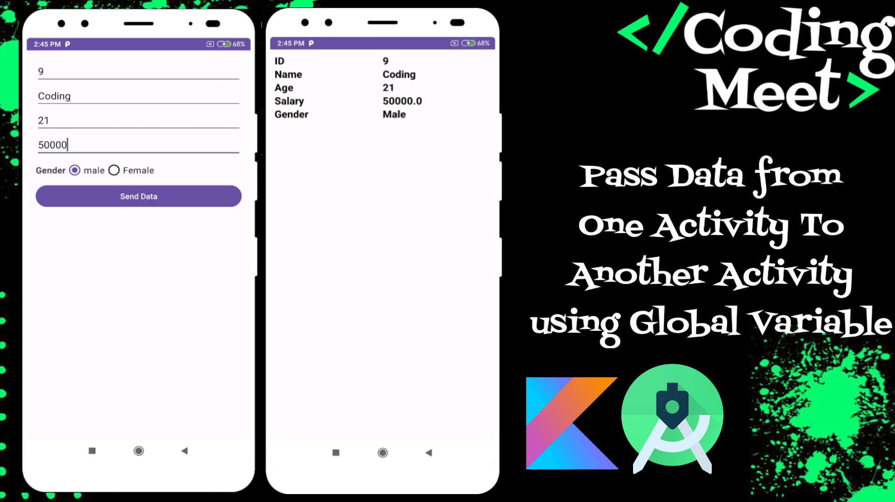
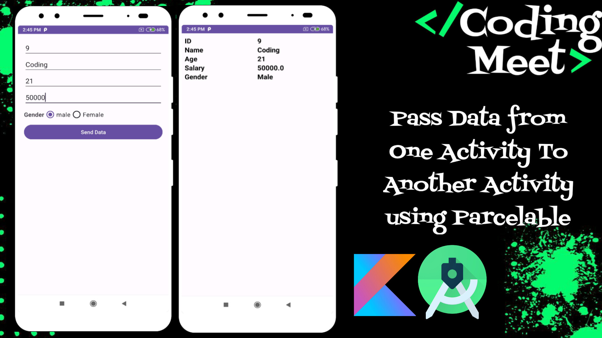

# Pass Data from One Activity To Another Activity - All Ways in Android Studio Kotlin

# [YouTube Video Link](https://www.youtube.com/playlist?list=PLlSuJy9SfzvGuWvfA7OKKwAotXZnMZBU6)

## Video List

1. **How to Pass Data from One Activity To Another Activity using Intent Android Studio Kotlin**

2. **How to Pass Data from One Activity To Another Activity using Global Variable Android Studio Kotlin**

3. **How to Pass Data from One Activity To Another Activity using Bundle Android Studio Kotlin**

4. **How to Pass Data from One Activity To Another Activity using Serializable Android Studio Kotlin**

5. **How to Pass Data from One Activity To Another Activity using Parcelable Android Studio Kotlin**

6. **How to Pass Data with OnClickListener from RecyclerView to Another Activity | Android Studio Kotlin**

Stay tuned for each tutorial in the series, and don't forget to like, subscribe, and hit the notification bell to stay updated with our latest content! 💰📱

## Support the Project

If you find this tutorial series helpful and would like to support the development of more content, consider buying me a coffee! Your support helps in creating high-quality tutorials.

Your generosity is greatly appreciated! Thank you for supporting this project.
